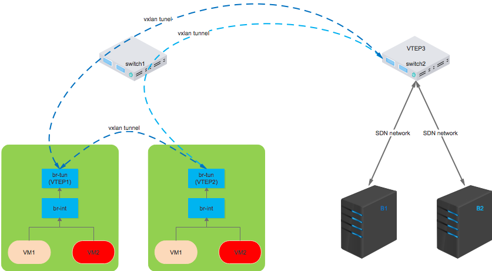
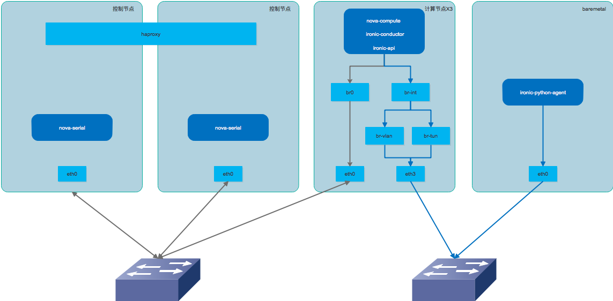

# openstack ironic 简介

工作交接

---

### Agenda
- what is ironic?
- ironic architecture
- how to boot a baremetal?
- online deployment

---
### what is ironic?

- ironic依赖的技术
  * PXE（Preboot execution environment）
  * DHCP （动态获取IP地址)
  * TFTP （简单文件传输协议）
  * NBP（网络引导程序）
  * IPMI（智能平台管理接口）

---
### baremetal as a service
- 目标
  * 和虚拟机一样容易获取
  * 和虚拟机类似的使用体验
  * 同一个用户的裸机和虚拟机可以相互通信

---
### how to implement BMaaS?
- 管理和记录裸机的配置信息
  * IPMI的信息
  * 资源：CPU、内存、磁盘、网络。。
  * 安装操作系统
  * 解决虚拟机与宿主机之间的通信问题

---
### ironic architecture


---
### ironic components
- ironic API
  * 保存裸机的配置信息、状态
  * 向其他项目提供REST API
- ironic conductor
  * 配合ironic API实现具体的管理工作
  * 包含很多不同的driver

---
### how to boot a baremetal?

```bash
$ nova boot --flavor xxx --image xxx --nic net-id=xxx xxx
```

---
### what happened on nova boot?

- 1，nova api 收到请求
- 2，经过调度，请求转发到支持ironic driver的nova-compute
- 3，nova-compute调用ironic API，让裸机开始安装操作系统

---
### what happened on nova boot?(2)
- 4，ironic收到请求后，更新裸机所在的交换机的配置，保证裸机可以通过DHCP获取IP地址
- 5，ironic调用IPMI让裸机从PXE启动，然后让裸机重启
- 6，裸机从PXE启动，通过DHCP获取IP地址和TFTP的地址
- 7，从TFTP下载内核和内存根文件系统
- 8，加载内核和根文件系统，并启动安装在根文件系统中的ironic-python-agent

---
### what happened on nova boot?(3)
- 9，ironic-python-agent启动后会与ironic通信，准备好系统盘，然后通知ironic，可以安装操作系统了
- 10，ironic会下载镜像到本地，然后写入裸机的系统盘
- 11，安装完操作系统之后，ironic通知ironic-python-agent在本地安装引导程序

---
### what happened on nova boot?(4)
- 13，安装完成后，ironic会调整裸机的网络配置，让裸机加入租户网络
- 14，ironic会删除裸机的网络引导程序，并让裸机重启从磁盘启动系统
- 15，ironic更新裸机的状态为active
- 16，nova-compute发现裸机变为active后返回

---
### how to build ironic images

- 构建安装系统的内核和ramdisk
- 构建用户使用的镜像
- [example](http://cf.polex.io/pages/viewpage.action?pageId=7869842#ironic%E6%89%8B%E5%8A%A8%E9%83%A8%E7%BD%B2%E6%96%87%E6%A1%A3-newton-7%E9%95%9C%E5%83%8F%E5%87%86%E5%A4%87)

---
### ironic network internal
- ironic API需要如下网络通信
  * nova API
  * nova-compute
  * ironic-python-agent
  * baremetal IPMI

---
### ironic network internal(2)
- ironic conductor
  * baremetal PXE
  * DHCP & TFTP
  * IPMI
  * glance API

---
### baremetal network internal
- provision network
- tenant network
  * vlan
  * vxlan

---
### baremetal network internal


---
### online deployment


---
### Thanks!
