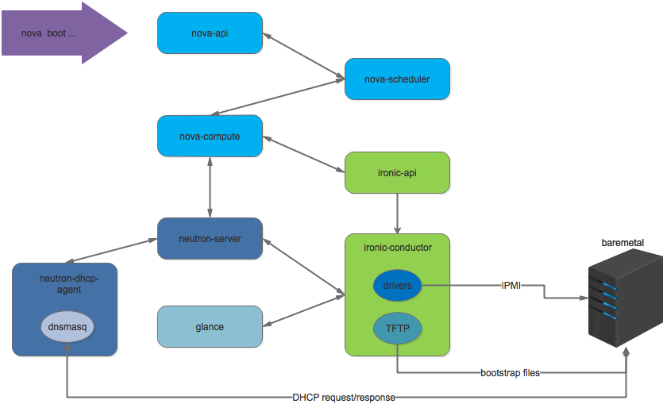

# openstack ironic 简介

工作交接

---

### Agenda
- what is ironic?
- ironic architecture
- how to boot a baremetal?
- online deployment

---
### what is ironic?

- ironic依赖的技术
  * PXE（Preboot execution environment）
  * DHCP （动态获取IP地址)
  * TFTP （简单文件传输协议）
  * NBP（网络引导程序）
  * IPMI（智能平台管理接口）

---
### baremetal as a service
- 目标
  * 和虚拟机一样容易获取
  * 和虚拟机类似的使用体验
  * 同一个用户的裸机和虚拟机可以相互通信

---
### how to implement BMaaS?
- 管理和记录裸机的配置信息
  * IPMI的信息
  * 资源：CPU、内存、磁盘、网络。。
  * 安装操作系统
  * 解决虚拟机与宿主机之间的通信问题

---
### ironic architecture

### ironic components

- ironic API
- ironic conductor

---
### Thanks!
